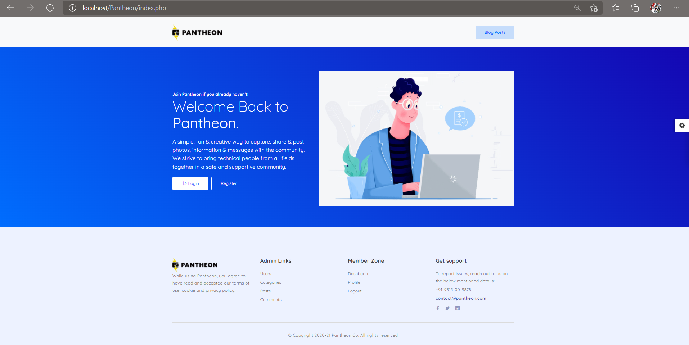
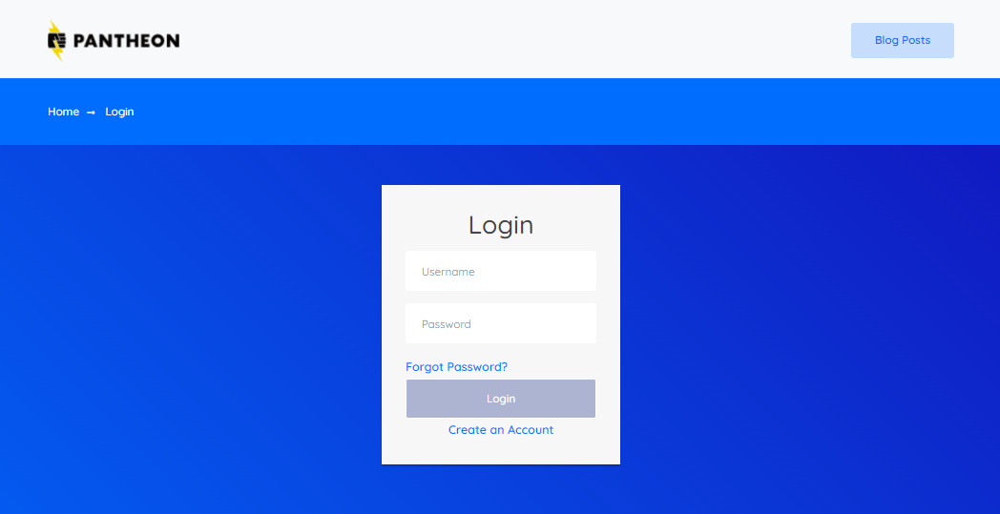
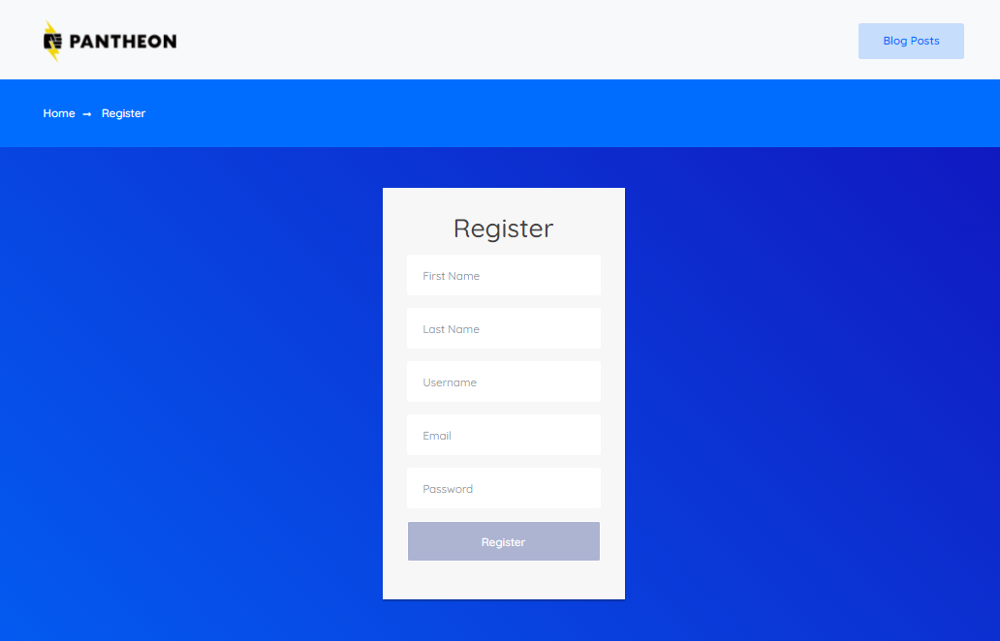
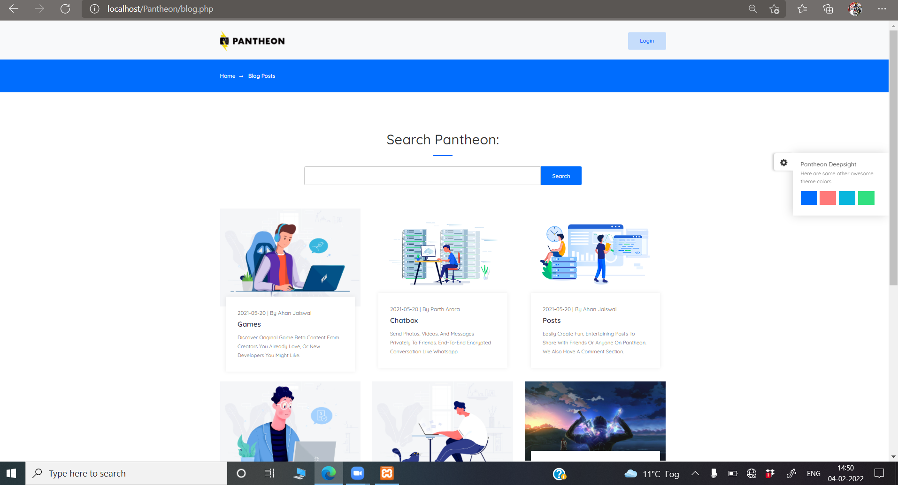
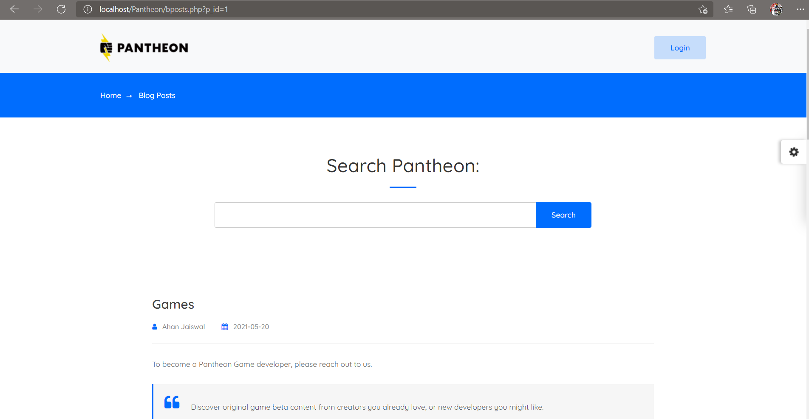
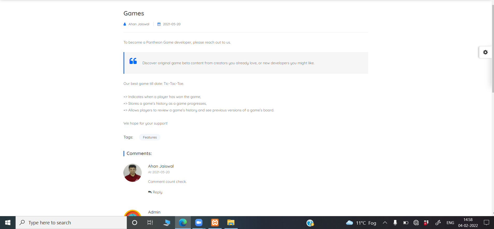
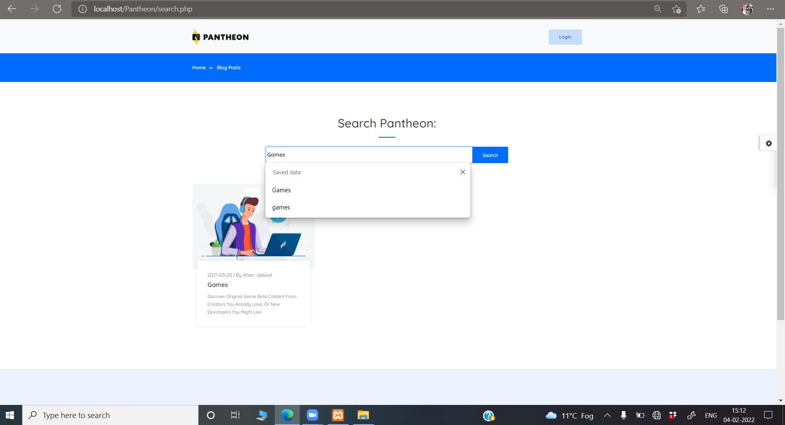
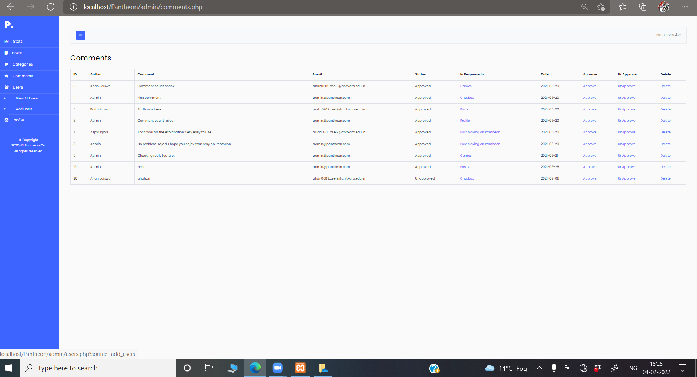
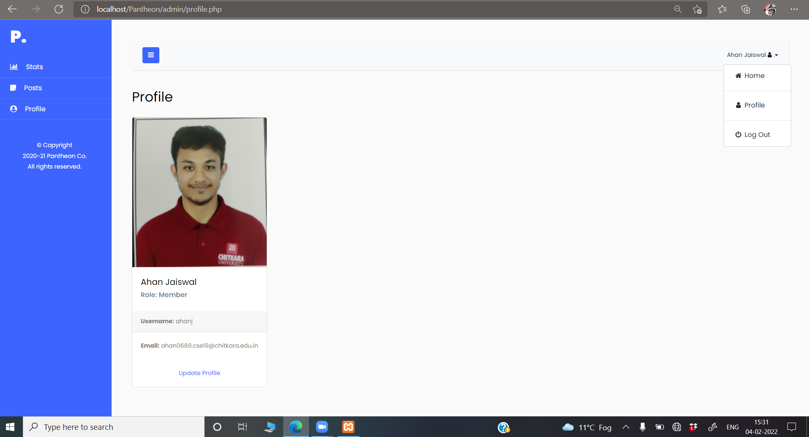

# Pantheon
This is a content management system built in *PHP* using *MySQL* database that can be used to create websites similar to WordPress, Drupal or Joomla. *Pantheon* is a framework that I have designed from scratch that can help users create, manage, and modify content on a premade website without the need for specialized technical knowledge.

I have also designed and developed a well thought out, user friendly interface for Pantheon which comes in 4 different themes that the user can switch while using the website.

## Features of Pantheon
- Supports two types of users : Admin & Member. 
- Admins have the ability to:
    1. Add, Update, View and Delete categories on Pantheon.
    2. Add, Update, View and Delete posts on Pantheon.
    3. Moderate comments by member users on all posts.
- Members have the ability to:
    1. Create, Update, View and Delete their own posts on the website.
    2. Members can leave comments on all posts that are published on Pantheon after moderation from Admin roles.
- Posts on Pantheon are accessible by all the visitors and members of the website.
- All posts can be categorised usings tags that can only be added by the Admins that is further used for Internal Search.
- Pantheon has internal search that has been setup so that users can search the whole array of posts on the website through their post titles or tags. 
- Visitors can browse through all the posts or make comments without an account but to create their own posts, they must have an account on Pantheon. 
- Only Users of Pantheon have the access to view the overall statistics of Pantheon which includes total amount of posts, users, comments and categories on the website.
- All visitors/users can browse Pantheon in four different themes. 

## How to download and run this framework locally

## Pantheon's Preview 

### Home
Landing page for Pantheon that lets you login or register and also leads you to all the blog posts on the website.

### Login/Register
Users can create account on Pantheon and login to them.

 

### Blog Posts
Blog posts page that allows all visitors/users to view all the posts on the website.

### Post Template
All the posts have the same layout.

### Comments Section
Visitors/Users can leave comments on posts. Visitors without an account would have to specify their details everytime before leaving a comment.

### Internal Search
Pantheon includes an internal search feature that allows users to search for what they are looking for on the website using keywords.

### Dashboard
#### How the dashboard looks for an admin role:

#### How the dashboard looks for a member role:

### Profile
All Pantheon users can view and update their profile.

## Technologies Used
The following are the technologies that have been used in the development of Pantheon. They are all free to use:
- Bootstrap v5.0.
- FontIcons.
- LineIcons.
- XAMPP (to mimic a web server)
- Visual Studio Code.
- phpMyAdmin

## Source Code
Pantheon's software code is designed to be very modular and reusable by packaging the two most used template layers into a single root folder.
- Pantheon : ['root'](root/)
- Dashboard : ['admin/root'](admin/root/)

## Work-in-Progress
This framework is a work in progress and more features are yet to be added with new technologies.
